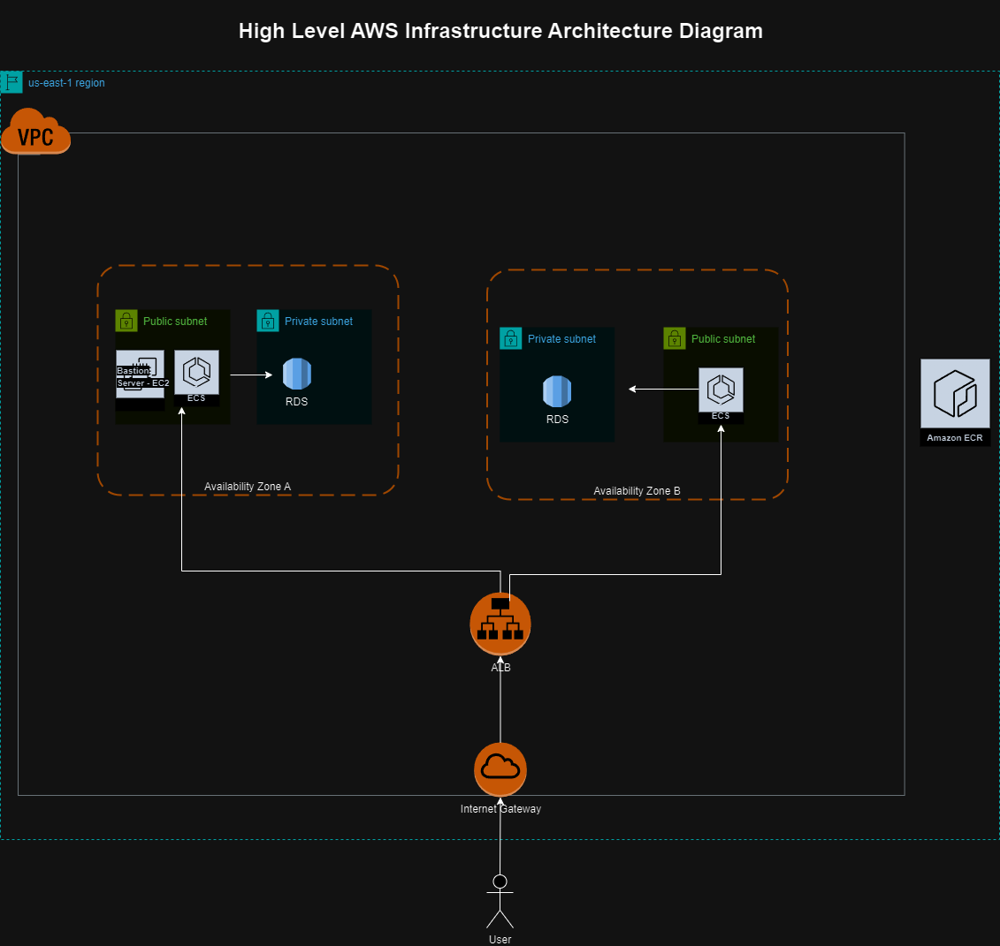
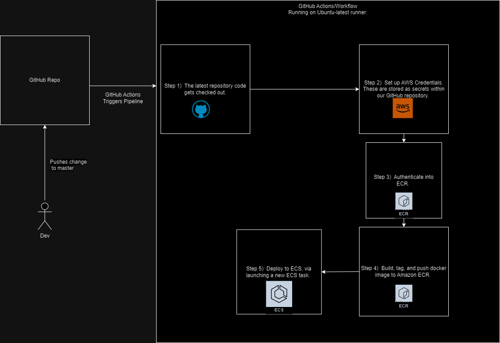

# System Description
The following Node.js application source code has been forked from the below repository. 
We have introduced the following high level infrastructure features: 
 - Infrastructure as code (IaC) via Terraform (**all infra managed through Terraform, except the EC2 bastion was created manually for testing purposes**).
 - Containerized the application via Docker (Dockerfile).
 - Orchestrated the application via ECS Fargate (hosted via ECR) using multiple az's for high availability.
 - CloudWatch logging for observability. 
 - Implemented a CI/CD pipeline via GitHub Actions.
 - Launched MySQL via RDS (included via Terraform). Hosted within a private subnet to ensure proper security.
 - Launched VPC, ALB, and additional AWS related networking resources to host our application.
 - Developed a PowerShell script to validate/health check API connectivity.
 - Created an EC2 Bastion server (within public subnet) to test internal network database connectivity.

Additional details can be found in our infrastructure architecture diagram.

## Forked from the below repository:
- https://github.com/bezkoder/vue-js-node-js-express-mysql

## Application URL (ALB DNS):
- http://main-lb-263015034.us-east-1.elb.amazonaws.com/#/

## Instructions on running the application locally via containerization (Docker)
1. Navigate to the root directory of your project where the Dockerfile is located:
```bash
$ cd vue-js-node-js-express-mysql-forked
```
2. Build your Docker image:
```bash
$ docker build -t node-app .
```
3. Run your Docker image locally:
```bash
$ docker run -it --rm --name node-app-container -p 8080:8080 node-app
```

## Instructions on launching the application onto AWS (ECS) via Terraform IaC (This includes launching our VPC and related resources.)
- Since we are using Terraform IaC, we will need to provision our resources in AWS with this method:
1. Navigate to the infra folder which contains our infrastructure related files (Terraform IaC).
```bash
$ cd infra
```
1. Once in the infra repo, we must initialize our .terraform directory:
```bash
$ terraform init
```
2. We will now run terraform plan in order to preview upcoming infrastructure changes, which is tracked via our state file:
```bash
$ terraform plan
```
3. Finally, once the plan has been reviewed, we are ready to provision our infrastructure via terraform apply:
```bash
$ terraform apply
```
## PowerShell Script to Test Our API:
- The following PowerShell script can be used to validate that the backend/API are working properly:
  - https://github.com/clazar818/vue-js-node-js-express-mysql-forked/blob/master/test-api.ps1
- Running the script, will add a new "Tutorial" into the database via the API (POST request).

## AWS Infrastructure Architecture Diagram


## GitHub Actions CI/CD Pipeline Architecture Diagram

